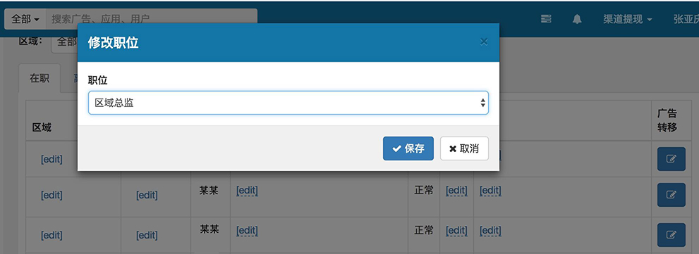

第一步：弹窗 Modal
========

> 本章的目的在于领大家入门。

弹窗除了用作通知以外，在后台产品当中还经常用来对特定属性进行修改，如下图所示：



对于这样的需求，在之前的产品中我是这么做的，首先，HTML 部分就按照 Bootstrap 的标准套路来写：

```html
<div class="modal fade" id="sales-editor">
  <div class="modal-dialog" role="document">
    <div class="modal-content">
      <div class="modal-header">
        <h5 class="modal-title">修改职位</h5>
        <button type="button" class="close" data-dismiss="modal" aria-label="Close">
          <span aria-hidden="true">&times;</span>
        </button>
      </div>
      <div class="modal-body">
        <form action="/api/sales/" data-action="/api/sales/{{id}}" method="POST" id="sales-editor-form">
          <input type="hidden" name="user_id" value="">
          <div class="form-group">
            <label for="type">职位</label>
            <select class="form-control" name="type" id="type">
              <option value="1">区域总监</option>
              <option value="2">商务经理</option>
              <option value="3">商务助理</option>
            </select>
          </div>
        </form>
      </div>
      <div class="modal-footer">
        <button type="button" class="btn btn-primary" form="sales-editor-form"><i class="fa fa-check"></i> 保存</button>
        <button type="button" class="btn btn-secondary" data-dismiss="modal"><i class="fa fa-times"></i> 取消</button>
      </div>
    </div>
  </div>
</div>
```

表格模板是这样的（只写单行吧，其它部分意义不大）：

```handlebars
<tr>
  <td>{{name}}</td>
  <td><button type="button" class="btn btn-primary edit-button" data-id="{{id}}">编辑</button></td>
</tr>
```

这两部分没什么好解释的。接下来 JS 的部分就稍显啰嗦：

```javascript
// 通过后端接口取出来所有商务数据
let allSales = fetchAllSales();

// 编辑按钮的点击事件，每次点击，除了打开新窗口，还要把表单里面的几个值修改一下
$('#table').on('click', '.edit-button', event => {
  let id = $(this).data('id');
  let sales = allSales[id];

  $('#sales-editor').modal('show')
    .find('[name=user_id]').val(id)
    .end().find('form').attr(function () {
      return $(this).data('action').replace('{{id}}', id);
    })
    .end().find('select').val(sales.type);
});
```

很明显，正如前文所写的那样，jQuery 用起来很方便，可以在 DOM 节点之间自由穿梭。但是因为它没有抽象，所以任何操作都要手工编写，会造成 JS 和 HTML 深度耦合，不仅不方便维护，新功能开发的时候也要写很多多余的代码。

接下来我们要用 Vue 实现同样地功能，应该怎么写呢？

首先我们可以观察一下 Bootstrap 里 Modal 的实现机制，很明显，它是通过修改 `.modal` 元素的 `display` 属性和增删 `show` 样式来实现的。那很简单，我们知道，Vue 里，可以通过 `:prop="someValue"` 把 vm 的值 `someValue` 绑定到 DOM 节点的 `prop` 属性上，所以控制弹窗的打开关闭就很简单：

```html
<div class="modal fade" :class="isShow ? 'show' : ''" :style="isShow ? 'display:block' : ''" id="sales-editor" @click.self="close">
  <!-- 内容 -->
</div>
<div class="modal-backdrop fade" :class="isShow ? 'show' : ''" v-show="isShow"></div>
```

```javascript
let app = new Vue({
  el: '#app',
  data: {
    isShow: false
  },
  methods: {
    show() {
      this.isShow = true;
    },
    close() {
      this.isShow = false;
    }
  }
});
```
（这里只列出重点代码，其它因为不影响大局就没有写。具体可以参考 [codepen oegbvK](https://codepen.io/meathill/pen/oegbvK?editors=1010)）

这样修改了之后，我发现打开关闭已经正常工作了，但是没有动画，看起来不够炫酷。没关系，我们审查元素，发现是 `.show` 样式增加的过渡效果，opacity 0 <-> 1，而同时设置 `display` 属性会使得它缺失过渡效果。那很简单，我们可以用 `watch` 观察选项，侦听 `isShow` 的变化，在它变化后，间隔一点点时间，再触发动画。关闭的动画就要侦听 `transitionend` 事件了，在关闭动画完成后再隐藏这部分元素。修改后的代码是这样的：

```html
<div class="modal fade" :class="isShowClass ? 'show' : ''" :style="isShow ? 'display:block' : ''" id="sales-editor" @click.self="close" @transitionend="hide">
  <!-- 内容 -->
</div>
<div class="modal-backdrop fade" :class="isShowClass ? 'show' : ''" v-show="isShow"></div>
```

``` javascript
let app = new Vue({
  el: '#app',
  data: {
    isShow: false,
    isShowClass: false
  },
  methods: {
    show() {
      this.isShow = true;
    },
    hide() {
      this.isShow = false;
    },
    close() {
      this.isShowClass = false;
    }
  },
  watch: {
    isShow(value) {
      setTimeout(() => {
        this.nextShow = value;
      }, 50);
    }
  }
});
```